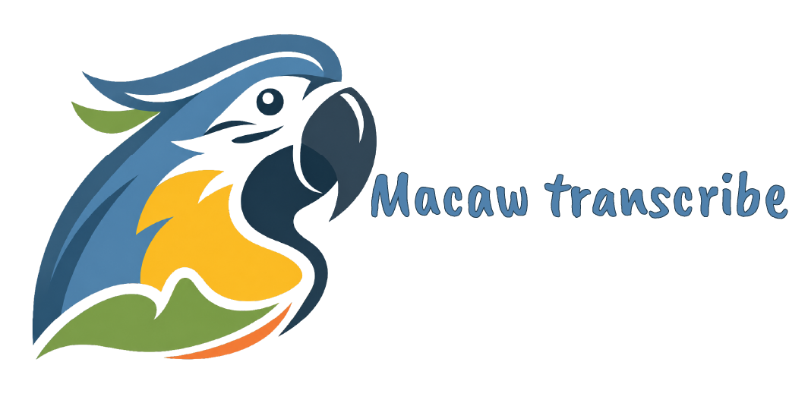
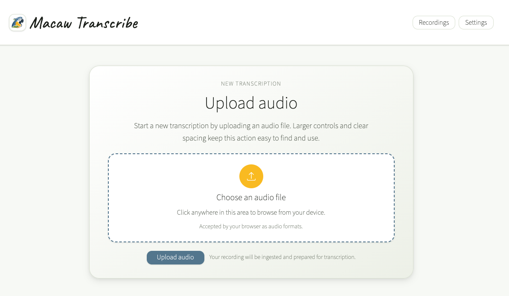
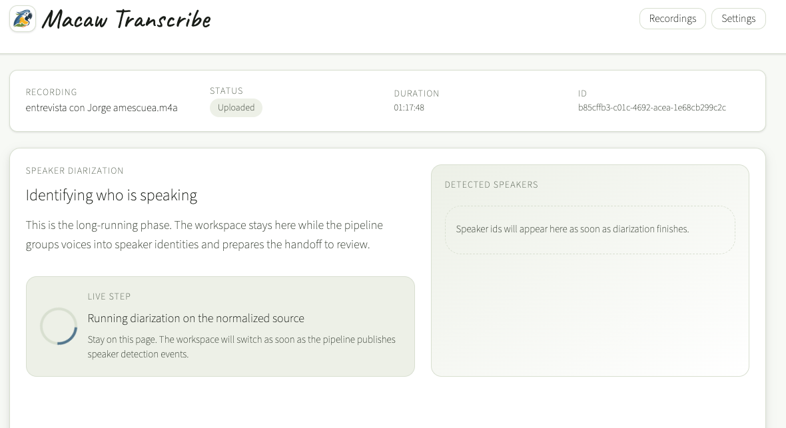
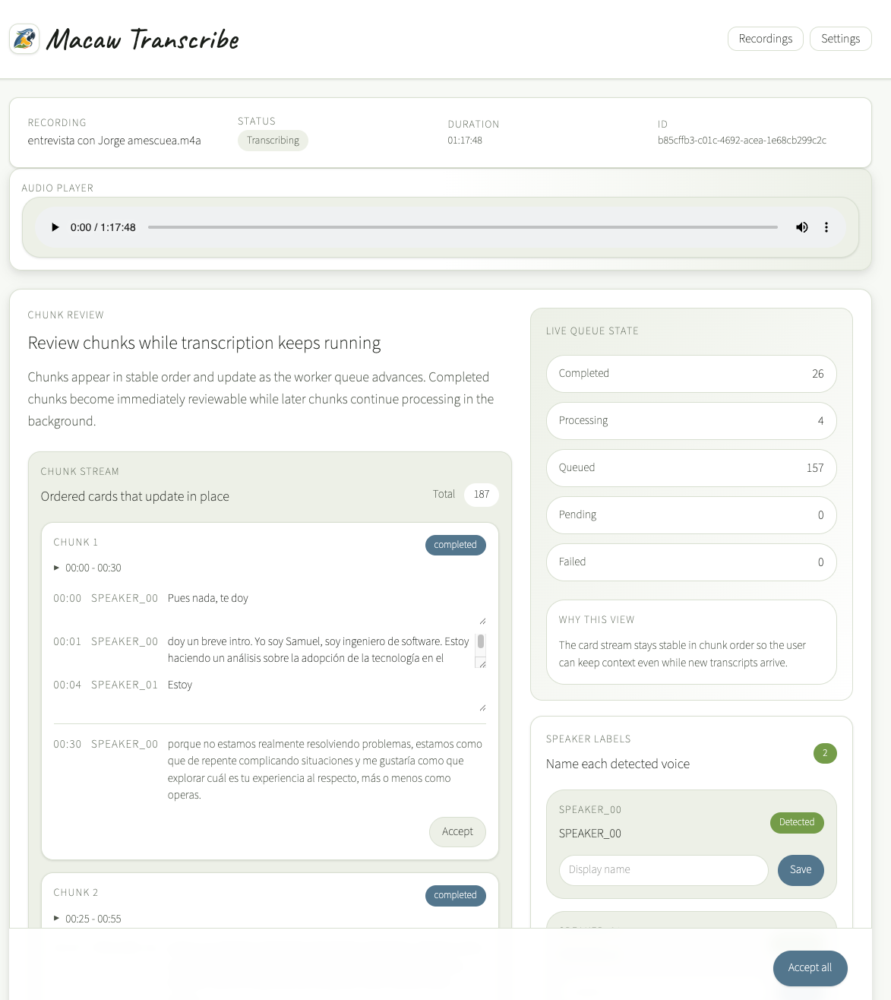
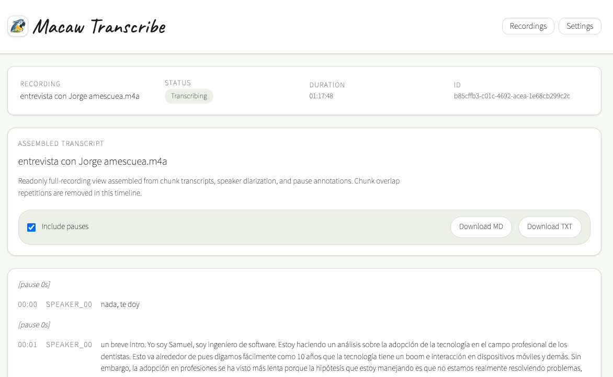
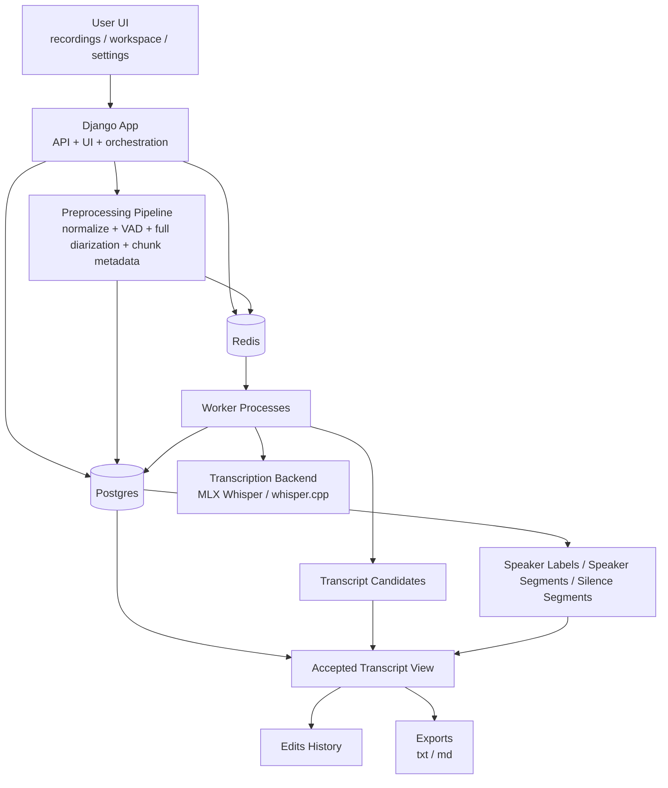

<p align="center">

</p>

## Disclaimer

- ⚠️ The project is under **active** development.
- ⚠️ Expect bugs and breaking changes.

# Macaw transcribe

A local-first transcription system designed to help you turn **long interviews, podcasts, research calls, and spoken notes** into transcripts organized by speaker, allowing you to review while processing continues.

This project is optimized for **Apple Silicon Macs** and runs entirely on your machine using open-source speech models.


1. [Why This Project Exists](#why-this-project-exists)
2. [What it is](#what-it-is)
3. [Key features](#key-features-v1)
4. [Current status](#current-status)
5. [Screenshoots & demo](#screenshoots--demo)
6. [Architecture overview](#architecture-overview)
7. [Requirements](#requirements)
8. [Installation](#installation)
9. [Running the app](#running-the-app)
9. Contributing

---

## Why This Project Exists

Most transcription tools follow the same workflow:

1. upload audio
2. wait for the full transcription to finish
3. review the transcript
4. fix errors

This approach becomes frustrating for **long recordings** (1–2 hours or more), where you may spend significant time 
waiting before even seeing the first result.

Even worse, if a section is poorly transcribed, you often need to **rerun the entire recording with a different model**.

This project was built to solve those problems.

## What it is

Macaw Transcribe helps people transcribe long recordings such as interviews, podcasts, research conversations, spoken notes, and private sessions while keeping audio under their control. It focuses on progressive transcription, speaker-aware review, real-time editing, and exportable transcripts.

## Key Features (V1)

The first version includes the following capabilities:

### Upload Long Recordings

Upload audio recordings and start transcription immediately. Supported formats:
- wav
- mp3
- m4a
- mp4

Once uploaded, the system automatically:

1. normalizes the audio
2. performs speaker diarization
3. splits the recording into processing chunks
4. starts transcription workers

Large recordings (1–2 hours) can be processed progressively.


### Progressive Transcription

Transcription results appear **chunk by chunk while the recording is still processing**. This allows users to:
- review transcripts immediately
- correct mistakes early
- validate accuracy while later chunks are still running

### Speaker Recognition

The system performs **speaker diarization on the full recording** before chunk transcription. Each transcript segment 
is associated with a speaker:
```
SPEAKER_00
How long have you been practicing dentistry?

SPEAKER_01
About twelve years now.
```

Speakers can be renamed at any time:
```
SPEAKER_00 → Interviewer
SPEAKER_01 → Guest
```

Renaming automatically updates the entire transcript.


### Real-Time Transcript Editing (Coming Soon)

The transcript can be edited **while transcription is still running**. Features:
- inline editing
- automatic save
- preserved edit history
- editing does not interrupt processing

Each chunk acts as an editable unit. This allows fast correction of mistakes without waiting for the full recording.


### Retry Chunks With Better Models (Coming Soon)

If a chunk is not transcribed correctly, users can retry it with a different model. Example workflow:
```
Chunk 17 → Retry
Select model → large-v3
Confirm
```

The retry job is queued while other chunks continue processing. This allows targeted accuracy improvements without 
rerunning the entire recording.

### Candidate Transcript Comparison (Coming Soon)

If a retried chunk produces a different result, the system keeps both versions. Users can compare transcripts:
- Current transcript 
  - Hello everyone welcome.
- Candidate (large model)
  - Hello everyone and welcome.

User choices:
- accept candidate
- keep current transcript

Both versions remain in history.

### Silence Detection and Pause Markers

Detected silence segments can appear as transcript markers. Example:
```
[pause 8s]

Guest
I was thinking about that.
```

These markers help capture conversational rhythm and pauses in interviews.

### Processing Transparency

Each chunk displays its processing state:
- pending
- queued
- processing
- completed
- failed
- needs review

Example:
```
Chunk 17
Model: medium
Status: completed
```
This gives full visibility into the transcription pipeline.

### Export Transcripts

Completed transcripts can be exported in multiple formats. Supported export formats:
- txt
- md
- json (Coming Soon)
- srt (Coming Soon)
- vtt (Coming Soon)

Exports are generated from the **accepted transcript**, not raw model output.

### Local-First and Private

All processing runs locally on your machine.
- audio never leaves your computer
- models run locally
- transcripts stay private
- no external APIs required

This makes the system suitable for sensitive interviews and research recordings.

> NOTE:
> Internet access is required the first run to download AI models.

### Optimized for Apple Silicon

The transcription pipeline is optimized for modern Apple Silicon processors. Supported backends:

- **MLX Whisper** (fastest on Apple Silicon)
- **whisper.cpp** fallback backend (Coming Soon)

Models can be selected from the UI settings.

### Built for Long Conversations

The system is designed specifically for:
- interviews
- podcasts
- research recordings
- oral history projects
- multi-speaker conversations

Key architectural features enabling this:
- full-recording diarization
- chunk-based transcription
- crash-safe recovery
- edit-while-processing workflow

---

## Current status

Macaw Transcribe is currently in active development. The first community release is being prepared. Some features may still change as the project moves toward a stable V1. Feedback, issues, and testing are welcome.

---

## Screenshoots & Demo

<p align="center">

</p>

<p align="center">

</p>

<p align="center">

</p>

<p align="center">

</p>

---

## Architecture overview



<details>
  <summary>End-to-End System Architecture: Click to expand/collapse</summary>
  
## End-to-End System Architecture

```text
┌──────────────────────────────────────────────────────────────────────┐
│                              USER / UI                               │
├──────────────────────────────────────────────────────────────────────┤
│  Recordings List  │  Recording Workspace  │  Settings / Advanced     │
│                   │                       │                          │
│  - upload audio   │  - audio player       │  - model selection       │
│  - see progress   │  - transcript editor  │  - backend selection     │
│  - open/export    │  - speaker renaming   │  - worker count          │
│  - delete         │  - retry chunk        │  - chunk duration        │
│                   │  - candidate review   │  - auto resume           │
└───────────────┬──────────────────────────────────────────────────────┘
                │
                ▼
┌──────────────────────────────────────────────────────────────────────┐
│                         DJANGO APP (HOST)                            │
├──────────────────────────────────────────────────────────────────────┤
│  API + UI + orchestration                                            │
│                                                                      │
│  Responsibilities:                                                   │
│  - receive uploads                                                   │
│  - create recording + chunk metadata                                 │
│  - trigger preprocessing pipeline                                    │
│  - expose transcript editor                                          │
│  - save accepted transcript edits                                    │
│  - queue retries                                                     │
│  - compare/accept candidates                                         │
└───────────────┬───────────────────────────────┬──────────────────────┘
                │                               │
                │                               │
                ▼                               ▼
┌───────────────────────────────┐     ┌───────────────────────────────┐
│         POSTGRES (DOCKER)     │     │          REDIS (DOCKER)       │
├───────────────────────────────┤     ├───────────────────────────────┤
│ Source of truth               │     │ Job queue / dispatch          │
│                               │     │                               │
│ Tables:                       │     │ Queues:                       │
│ - recordings                  │     │ - default transcription queue │
│ - chunks                      │     │ - retry jobs                  │
│ - speaker_segments            │     │                               │
│ - silence_segments            │     └───────────────┬───────────────┘
│ - transcript_words            │                     │
│ - transcripts                 │                     │
│ - edits                       │                     │
│ - transcript_candidates       │                     │
│ - speaker_labels              │                     │
│ - system_settings             │                     │
└───────────────┬───────────────┘                     │
                │                                     │
                │                                     ▼
                │                      ┌────────────────────────────────┐
                │                      │       WORKER PROCESS(ES)       │
                │                      │            (HOST)              │
                │                      ├────────────────────────────────┤
                │                      │ - claim chunk job              │
                │                      │ - update heartbeat             │
                │                      │ - load backend/model cache     │
                │                      │ - extract chunk on demand      │
                │                      │ - transcribe chunk             │
                │                      │ - store transcript_words       │
                │                      │ - build machine draft          │
                │                      │ - update chunk status          │
                │                      └───────────────┬────────────────┘
                │                                      │
                │                                      ▼
                │                      ┌────────────────────────────────┐
                │                      │    TRANSCRIPTION BACKENDS      │
                │                      │            (HOST)              │
                │                      ├────────────────────────────────┤
                │                      │ Default on macOS: MLX Whisper  │
                │                      │ Fallback: whisper.cpp          │
                │                      │ Models: small / medium /       │
                │                      │         large-v3               │
                │                      └────────────────────────────────┘
                │
                ▼
┌──────────────────────────────────────────────────────────────────────┐
│                    PREPROCESSING / ORCHESTRATION                     │
│                              (HOST)                                  │
├──────────────────────────────────────────────────────────────────────┤
│  1. Store original audio                                             │
│  2. Normalize audio → normalized.wav                                 │
│  3. Run VAD → silence_segments                                       │
│  4. Run diarization on full recording → speaker_segments             │
│  5. Create fixed chunks (metadata only, no chunk files)              │
│  6. Enqueue chunk transcription jobs                                 │
└──────────────────────────────────────────────────────────────────────┘

                               DATA FLOW

Upload audio
   ↓
Store original + normalized audio
   ↓
Run VAD + full-recording diarization
   ↓
Create chunk metadata in DB
   ↓
Queue chunk jobs in Redis
   ↓
Workers transcribe chunks
   ↓
Store transcript_words
   ↓
Align words with speaker_segments
   ↓
Generate initial accepted chunk transcript
   ↓
User edits accepted transcript
   ↓
Edits saved to history
   ↓
Optional retry with better model
   ↓
Store transcript candidate
   ↓
User chooses accepted version
   ↓
Export final transcript
```
</details>

---

## Requirements

This  project is not fully Dockerized. The recommended local setup is a hybrid setup:

- Django, Gunicorn, ML workers, and model execution run directly on the host.
- PostgreSQL and Redis can run through the existing `docker-compose.yml`.
- `ffmpeg`/`ffprobe` must be installed on the host because audio normalization and chunk extraction call those binaries directly.

The commands below assume macOS on Apple Silicon, which is the primary target for the current MLX Whisper backend.

Install the required host tools:
<details>

<summary>If you don't have Homebrew: Click to expand/collapse</summary>

Follow the official instructions at <a href="https://brew.sh/" target="_blank">brew.sh</a>.
```
/bin/bash -c "$(curl -fsSL https://raw.githubusercontent.com/Homebrew/install/HEAD/install.sh)"
```

</details>

```bash
brew install python@3.14 uv ffmpeg node
```

Install Docker Desktop for PostgreSQL and Redis:
Go to <a href="https://www.docker.com/products/docker-desktop/" target="_blank">docker-desktop</a>, download the package and follow instalation
guide.

Verify the tools:

```bash
python3.14 --version
uv --version
ffmpeg -version
ffprobe -version
node --version
npm --version
docker --version
```

---

## Installation

### 1. Clone the repository

```
git clone https://github.com/samuelkb/MacawTranscribe.git
cd MacawTranscribe
```
### 2. Configure environment variables

Create the local `.env` file from the example:

```bash
cp .env.example .env
```

Edit `.env` and set real values:

<details>

<summary>For password and secrets generation: Click to expand/collapse</summary>

We can use python to generate `DJANGO_SECRET_KEY`, `POSTGRES_PASSWORD` and `REDIS_PASSWORD`.

In a terminal run:
```
python3
```
That will open an interactive Python console, where you can paste:
```
import secrets

print(f"DJANGO_SECRET_KEY={secrets.token_urlsafe(64)}")
print(f"POSTGRES_PASSWORD={secrets.token_urlsafe(32)}")
print(f"REDIS_PASSWORD={secrets.token_urlsafe(32)}")
```
</details>

```dotenv
DJANGO_DEBUG=True
DJANGO_SECRET_KEY=replace_with_a_long_random_secret

HUGGINGFACE_ACCESS_TOKEN=hf_your_token

POSTGRES_DB=macaw_transcribe
POSTGRES_USER=macaw_user
POSTGRES_PASSWORD=replace_with_a_real_password
POSTGRES_HOST=127.0.0.1
POSTGRES_PORT=5432

REDIS_HOST=127.0.0.1
REDIS_PORT=6379
REDIS_PASSWORD=replace_with_a_real_password
REDIS_DB=0
```

### 3. Create Hugging Face Access

The app downloads and runs models from Hugging Face. A token is required for both MLX Whisper downloads and pyannote diarization.

1. Create or sign in to a Hugging Face account <a href="https://huggingface.co/login" target="_blank">HuggingFace login</a>.
2. Create an access token with `READ` permissions at <a href="https://huggingface.co/settings/tokens" target="_blank">HuggingFace tokens</a>.
3. Put the token in `.env` as `HUGGINGFACE_ACCESS_TOKEN`.
4. Visit the diarization model card and accept the model terms: <a href="https://huggingface.co/pyannote/speaker-diarization-community-1" target="_blank">speaker-diarization-community-1</a>

The code uses `pyannote/speaker-diarization-community-1` by default. If access has not been accepted, the first diarization run will fail while loading the pyannote pipeline.

### 4. Install Python Dependencies

Sync the Python environment from `pyproject.toml` and `uv.lock`:

```bash
uv sync
```

### 5. Install and Build Frontend Assets

Install Node dependencies:

```bash
npm install
```

Build the Tailwind output used by Django templates:

```bash
npm run tw:build
```

### 6. Start PostgreSQL and Redis

Use the included Compose file for infrastructure only:

```bash
docker compose up -d postgres redis
```

Check that both services are healthy:

```bash
docker compose ps
```

### 7. Prepare the Database

Run migrations:

```bash
uv run python manage.py migrate
```

Collect static files for a production-style run:

```bash
uv run python manage.py collectstatic --noinput
```

### 8. Preflight Check

Run Django checks:

```bash
uv run python manage.py check
```

### 9. Start the App With Gunicorn

Start the web process in Terminal 1:

```bash
uv run gunicorn MacawTranscribe.wsgi:application \
  --bind 127.0.0.1:8000 \
  --workers 2 \
  --timeout 300 \
  --access-logfile - \
  --error-logfile -
```

Open: <a href="http://127.0.0.1:8000/" target="_blank">http://127.0.0.1:8000/</a>.

### 10. Start Background Supervisors

In Terminal 2, run transcription worker supervisor:

```bash
uv run python manage.py run_worker_supervisor
```

In Terminal 3, run workspace pipeline supervisor:

```bash
uv run python manage.py run_workspace_supervisor
```

The transcription supervisor reads runtime settings from the database. By default,
it creates MLX Whisper workers using the default backend/model from 
`TranscriptionRuntimeSettings`. The workspace supervisor maintains workspace pipeline
workers using the Django settings defaults.

---

## Running the app

Once you went to the installation successfully, to use the app every time you want, the steps are shorter:

1. Open Docker desktop dashboard: Open Docker in your MacBook, go to the icon in the right-top corner, right-click and select  `go to the dashboard`. 
2. Ensure `macawtranscribe` is running, if not, click in the `start` icon, and verify `macaw_postgres` and `macaw_redis` are running.
3. Open `Terminal` and execute the following commands in a different window each one:

```bash
uv run gunicorn MacawTranscribe.wsgi:application \
  --bind 127.0.0.1:8000 \
  --workers 2 \
  --timeout 300 \
  --access-logfile - \
  --error-logfile -
```

```bash
uv run python manage.py run_worker_supervisor
```

```bash
uv run python manage.py run_workspace_supervisor
```

4. Navigate to <a href="http://127.0.0.1:8000/" target="_blank">http://127.0.0.1:8000/</a> and start using the app
